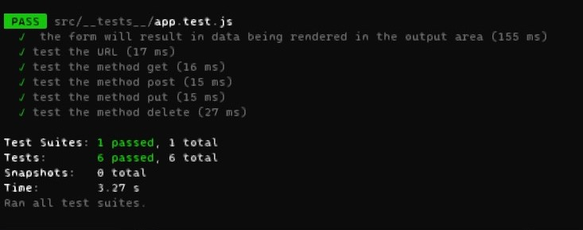
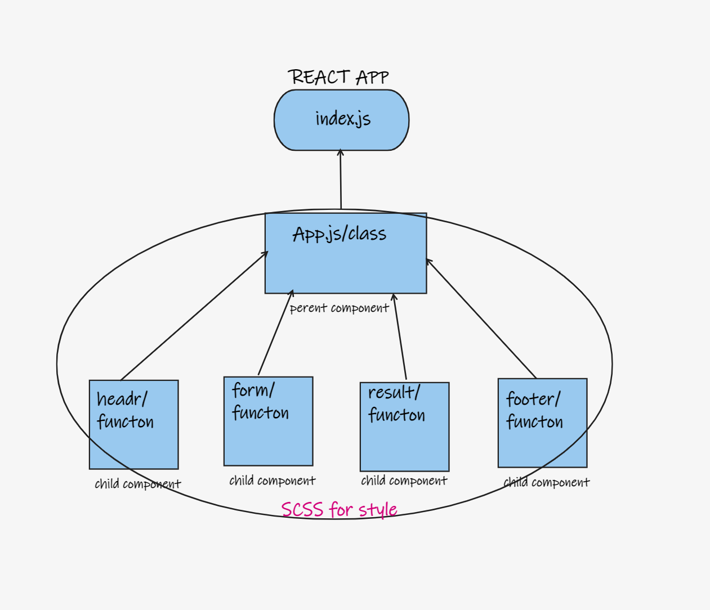

# RESTy

## description

- create client app tp to test API
- **phase1**
  - structure the starter code child components to function base components.
- **phase2**
  - Extend your React Application so that your functional components are able to manage their own state variables using the `useState Hook`.
  - **NOTE: It is not a requirement to make the actual API call. That can be mocked with “fake” data**

## test
- **phase2**
  - [sandbox test](https://codesandbox.io/s/priceless-driscoll-yurw4?file=/__tests__/app.test.js:55-63)
  - 
## features

- React.js
- SCSS

## deploy
- **phase1**
  - [sandbox](https://codesandbox.io/s/dreamy-shirley-od4g3?file=/src/components/form/form.scss)
- **phase2**
  - [sandbox](https://codesandbox.io/s/priceless-driscoll-yurw4?file=/src/index.js)

## UML

